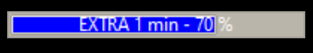

# Python Progress Timer

“Time – the one asset none of us are ever going to get more of.”
– Gary Vaynerchuk

We have all been in meeting and presentations and found it difficult to manage our time and get keep on time. The Python Progress bar is a very simple sample application that provides a visual guide to your audience to help show progress.

The sample application is implemented to be placed over top any window on the main display. As a result it can be included on top of an exiting presentation or live screen sharing session to track progress.

By being outside a presentation or slide you can switch between slides or across applications and still provide the visual cue on progress.

## Getting Started

1. Ensure you have python >= 3.6 installed.

1. Install python requirements

```bash
pip install -r requirements.txt
```

1. Run sample

```bash
python timer.py
```

## Usage

The command line will ask how long to display timer. At the prompt you can enter the number minutes to add to the progress bar. If you need to extend the time you can prefix the time with e. For example to extend the time by 2 minutes type **e2**.

You can also use the hot keys below to change the visible time in the progress bar.

To exit the application use **q** command.

## Colors

By default the color of the bar will change to the warning color (orange by default) at 60% and final color (red by default) at 80% complete.


The extended time uses red, blue, purple color schema by default so that visually you can see that in extra allocated time.





You can use the [config.json](./config.json) file to change the default colors.

## Hotkeys

The application has the following hot keys defined

\<ctrl\>+\<alt\>+0 - Clear Timer

\<ctrl>+\<alt\>+1 - \<ctrl\>+\<alt\>+9 Set Time from [times.txt](./times.txt)

\<ctrl\>+\<shift\>+1 - \<ctrl>+\<shift\>+9 Set Time Extra time 1 - 5 minutes

\<ctrl\>+\<alt\>+h - Hide / show the progress bar

## Configuration

The [config.json](./config.json) provides you the ability to change:

1. The top / left location of the progress bar on the display

1. The text prefix to add when add extra time

1. The primary colors for default, warning and final sections of the progress bar

1. The alternate colors for extra time with default, warning and final sections of the progress bar

1. The ability to change the warning and final color changes

## Technical Details

This minimal sample application uses the Python [tkinker](https://docs.python.org/3/library/tkinter.html) module to implement a top of screen overlay and progress bar visual.
